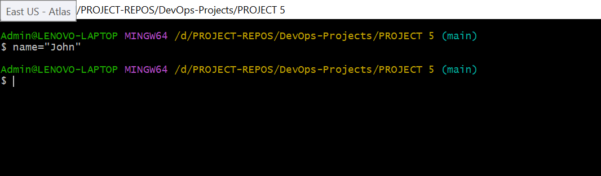
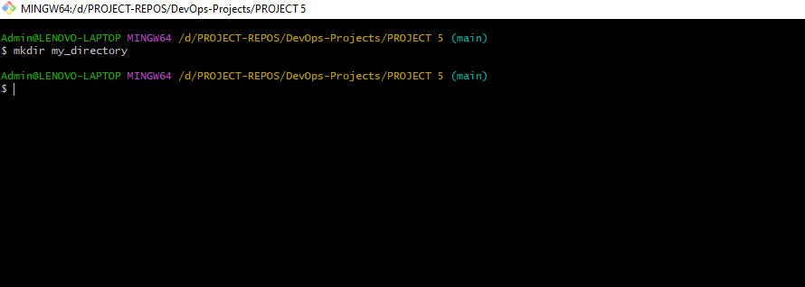
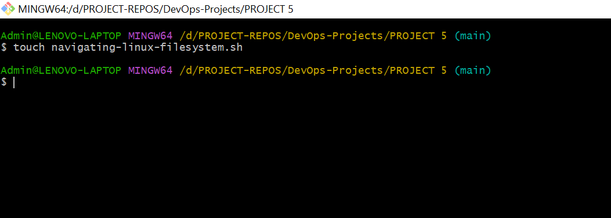

# SHELL SCRIPTING HANDS-ON PROJECTS.

## INTRODUCTION TO SHELL SCRIPTING AND USER INPUT.

## Shell Scripting Syntax Elements

1. Variables: Bash allows you to define and work with variables. Variables can store data of various type such as numbers, strings, and arrays. You can assign values to variables using the operator, and access their values using the variable name proceeded to a $ sign.

Bash Shell Location 

```javascript
which bash
```

#! /usr/bin/bash


## EG. Assigning a value to a variable

```javascript
name="John"
```



## Retrieving value from a variable

```javascript
echo $name
```


2. Control Flow: Bash provides control flow statements like if-else, for loops, while loops, and case statement to control the flow of execution in your scripts. These statements allow you to make decisions, iterate over list, and execute different commands based on condition.

#!/bin/bash

# Example script to check if a number is positive, negative, or zero

```javascript
read -p "Enter a number: " num

if [ $num -gt 0 ]; then
    echo "The number is positive."
elif [ $num -lt 0 ]; then
    echo "The number is negative."
else
    echo "The number is zero."
fi
```


The piece of code prompts you to type a number and prints a statement stating the number is positive or negative.

EG. Iterating through a list using a for loop

```javascript
#!/bin/bash

# Example script to print numbers from 1 to 5 using a for loop

for (( i=1; i<=5; i++ ))
do
    echo $i
done
```


3. Command Substitution: Command substitution allows you to capture the output of the command and use it as a value within your script. You can use the backtick or the $() syntax for command substitution.

EG. Using backtick for command substitution

```javascript
current_date=`date +%Y-%m-%d`
```


Using $() syntax for command subsctitution

```javascript
current_date=$(date +%Y-%m-%d)
```

 syntax for command subsctitution.PNG>)

4. Input and Output: Bash provides various ways to handle input and output. You can use the read command to accept user input, and output text to the console using the echo command. Additionally, you can redirect input and output using operators like > (output to a file), < (input from a file), and | (pipe the output of one command as input to another)

EG. Accept user input

```javascript
echo "Enter your name:"
read name
```


EG. Output text to the terminal

```javascript
echo "Hello World"
```


EG. Out the result of a command into a file.

```javascript
echo "hello world" > index.txt
```

EG. Pass the content of a file as input to a command

```javascript
grep "pattern" < input.txt
```

EG. Pass the result of a command as input to another command.
```javascript
echo "hello world" | grep "pattern"
```


5. Function: Bash allows you to define and use functions to group related commands together. Functions provide a way to modularize your code and make it more reusable. You can define functions using the function keyword or simply by declaring the function name followed by parentheses.

```javascript
#!/bin/bash

# Define a function to greet the user
greet() {
    echo "Hello, $1! Nice to meet you."
}

# Call the greet function and pass the name as an argument
greet "John"
```


## LET'S WRITE OUR FIRST SHELL SCRIPT.

Step1: Create a folder called shell-scripting

```javascript
mkdir shell-scripting
```


Step2: cd into the shell-scripting folder and create a file called user-input.sh

```javascript
touch user-input.sh
```


Step3/4: Inside the file, copy and paste the block below, and then Save the file.

```javascript
vi user-input.sh
```


```javascript
#!/bin/bash

# Prompt the user for their name
echo "Enter your name:"
read name

# Display a greeting with the entered name
echo "Hello, $name! Nice to meet you."
```


Step 5: Run the below command

```javascript
sudo chmod +x user-input.sh
```


Step 6: Run the below command

```javascript
./user-input.sh
```


## DIRECTORY MANIPULATION AND NAVIGATION

This script will display the current directory, create a new directory called "my_directory," change to that directory, create two files inside it, list the files, move back one level up, remove the "my_director" and its contents, and finally list the files in the current directory again.



Steps are outlined below:

Step 1: Open a file named <b>navigating-linux-filesystem.sh

```javascript
touch navigating-linux-filesystem.sh
```



Step 2: Paste the code block into the file

```javascript
nano navigating-linux-filesystem
```

```javascript
#!/bin/bash

# Display current directory
echo "Current directory: $PWD"

# Create a new directory
echo "Creating a new directory..."
mkdir my_directory
echo "New directory created."

# Change to the new directory
echo "Changing to the new directory..."
cd my_directory
echo "Current directory: $PWD"

# Create some files
echo "Creating files..."
touch file1.txt
touch file2.txt
echo "Files created."

# List the files in the current directory
echo "Files in the current directory:"
ls

# Move one level up
echo "Moving one level up..."
cd ..
echo "Current directory: $PWD"

# Remove the new directory and its contents
echo "Removing the new directory..."
rm -rf my_directory
echo "Directory removed."

# List the files in the current directory again
echo "Files in the current directory:"
ls
```


```javascript
cat navigating-linux-filesystem
```


Step 3: Run the command sudo chmod +x navigating-linux-filesystem.sh

```javascript
sudo chmod +x navigating-linux-filesystem.sh
```


Step 4: Run the script using the command ./navigating-linux-filesystem.sh


## FILE OPERATIONS AND SORTING

This script creates three files (file1.txt, file2.txt and file3.txt) displays the files in their current orders, sorts them alhabetically, saves the sorted files in sorted_files.txt, displays the sorted files, removes the original files, renames the sorted file to sorted_files_sorted_alphabetically.txt, and finally displays the contents of the sorted file.

Steps are outlined below:

Step 1: Open the terminal and create a file called sorting.sh using the command

```javascript
touch sorting.sh
```


Steps 2:

```javascript
nano sorting.sh
```

Copy and paste the code below in the created file

```javascript
#!/bin/bash

# Create three files
echo "Creating files..."
echo "This is file3." > file3.txt
echo "This is file1." > file1.txt
echo "This is file2." > file2.txt
echo "Files created."

# Display the files in their current order
echo "Files in their current order:"
ls

# Sort the files alphabetically
echo "Sorting files alphabetically..."
ls | sort > sorted_files.txt
echo "Files sorted."

# Display the sorted files
echo "Sorted files:"
cat sorted_files.txt

# Remove the original files
echo "Removing original files..."
rm file1.txt file2.txt file3.txt
echo "Original files removed."

# Rename the sorted file to a more descriptive name
echo "Renaming sorted file..."
mv sorted_files.txt sorted_files_sorted_alphabetically.txt
echo "File renamed."

# Display the final sorted file
echo "Final sorted file:"
cat sorted_files_sorted_alphabetically.txt
```


Step 3:
Set execute permission on sorting.sh using this command

```javascript
sudo chmod +x sorting.sh
```


Step 4: 
Run the script using the command

```javascript
./sorting.sh
```


## WORKING WITH NUMBERS AND CALCULATIONS

This script defines 2 variables num1 and num2 with numeric values, performs basic arithmetic operations (addiition, subtraction, multiplication, division and modulus), and displays the results. It also performs more complex calculations such as raising num1 to the power of 2 and calculating the square root of num2 and displays those results as well.

The steps are outlines below:

Step 1: Create a file called

```javascript
touch calculations.sh
```


Step 2:

```javascript
nano calculations.sh
```

Copy and paste the code below in the created file

```javascript
#!/bin/bash

# Define two variables with numeric values
num1=10
num2=5

# Perform basic arithmetic operations
sum=$((num1 + num2))
difference=$((num1 - num2))
product=$((num1 * num2))
quotient=$((num1 / num2))
remainder=$((num1 % num2))

# Display the results
echo "Number 1: $num1"
echo "Number 2: $num2"
echo "Sum: $sum"
echo "Difference: $difference"
echo "Product: $product"
echo "Quotient: $quotient"
echo "Remainder: $remainder"

# Perform some more complex calculations
power_of_2=$((num1 ** 2))
square_root=$(echo "sqrt($num2)" | bc)

# Display the results
echo "Number 1 raised to the power of 2: $power_of_2"
echo "Square root of number 2: $square_root"
```


Step 3:
Set execute permission on sorting.sh using this command

```javascript
sudo chmod +x calculations.sh
```


Step 4: 
Run the script using the command

```javascript
./calculations.sh
```


## FILE BACKUP AND TIMESTAMPING

This script defines source directory and backup directory paths. it then create timestamps using the current date and time,and create a backup directory with the timestamp appended to its name. The script then copies all files from the source directory to the backup directory using the cp command with -r option for recursive coping. Finally,it displays a message indicating the completion of the backup process and shows the path of the backup directory with the timestamp


Below are the outlined steps:

Step 1: Create a file called;

```javascript
touch backup.sh
```


Step 2:

```javascript
nano backup.sh
```

Copy and paste the code below in the created file

```javascript
#!/bin/bash

# Define the source directory and backup directory
source_dir="/path/to/source_directory"
backup_dir="/path/to/backup_directory"

# Create a timestamp with the current date and time
timestamp=$(date +"%Y%m%d%H%M%S")

# Create a backup directory with the timestamp
backup_dir_with_timestamp="$backup_dir/backup_$timestamp"

# Create the backup directory
mkdir -p "$backup_dir_with_timestamp"

# Copy all files from the source directory to the backup directory
cp -r "$source_dir"/* "$backup_dir_with_timestamp"

# Display a message indicating the backup process is complete
echo "Backup completed. Files copied to: $backup_dir_with_timestamp"
```


Step 3:
Set execute permission on sorting.sh using this command

```javascript
sudo chmod +x backup.sh
```


Step 4: 
Run the script using the command

```javascript
./backup.sh
```


