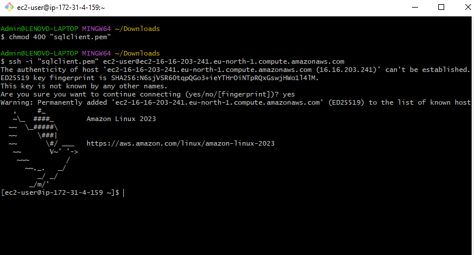
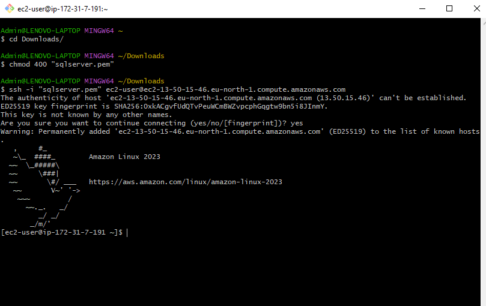

# UNDERSTANDING CLIENT-SERVER ARCHITECTURE

## Client Server Architecture with MySQL

### What is Client-server architecture?

Client-server refers to an architecture in which two or more computers are connected over a network to send and receive request s between one and another.

In their communication, each machine has its own role : The machine sending the request is referred to as the CLIENT and the machine responding (serving) is referred to as the <b> SERVER.

# IMPLEMENTING CLIENT-SERVER ARCHITECTURE USING MYSQL DATABASE MANAGEMENT SYSTEM

## To demonstrate basic client-server using MySQL RDBMS

### Create and configure two linux based virtual servers (EC2 instances on AWS)

Server 1: MySQL-Server (To serve information)

Server 2: MySQL-Client (To request information)


Connect to AWS Server and Client using Git Bash






Step 2: 

I connected the two EC2 instances created to the terminal using the command ssh -i "sqlclient.pem" ec2-user@ec2-16-170-166-245.eu-north-1.compute.amazonaws.com for sqlclient and ssh -i "sqlserver.pem" ec2-user@ec2-13-53-186-238.eu-north-1.compute.amazonaws.com for sqlserver

I ran the command sudo apt update to update both servers

```javascript
sudo apt update
```


I ran the command sudo apt install mysql-server to install mysql-server and sudo apt install mysql-client

```javascript
sudo apt install mysql-server
```


```javascript
sudo apt install mysql-client
```


Step 3: By default both EC2 virtual servers are located in the same local virtual network. so they can communicate with eachother using using local <b> IP address

Add mysql client private ip to mysql server inbound rule to grant client access to server.


Step 4: Configure MySQL server to allow connects from remote hosts.

```javascript
sudo nano /etc/mysql/mysql.conf.d/mysqld.cnf 
```

Replace the bind address (127.0.0.1) with the address 0.0.0.0


Step 6: From mysql client connect to mysql server

To connect mySQL-client to mySQL-server without using SSH:

I opened mySQL console on mySQL-server.

```javascript
sudo mysql
```


I created a user to be indentified by a password using the below command; 

```javascript
CREATE USER 'Client_user'@'172.31.%' IDENTIFIED BY 'password2';
```


I granted privileges using the command;

```javascript
 GRANT ALL PRIVILEGES ON *.* TO 'Client_user'@'172.31.%';
```


I flushed privileges using the command; and then exit

```javascript
FLUSH PRIVILEGES;
```


EXIT

Restarted mysql server

```javascript
sudo systemctl restart mysql.service
```


From the client, I ran the below command;

```javascript
mysql -u Client_user -p -h 172.31.9.122
```


THANK YOU!!